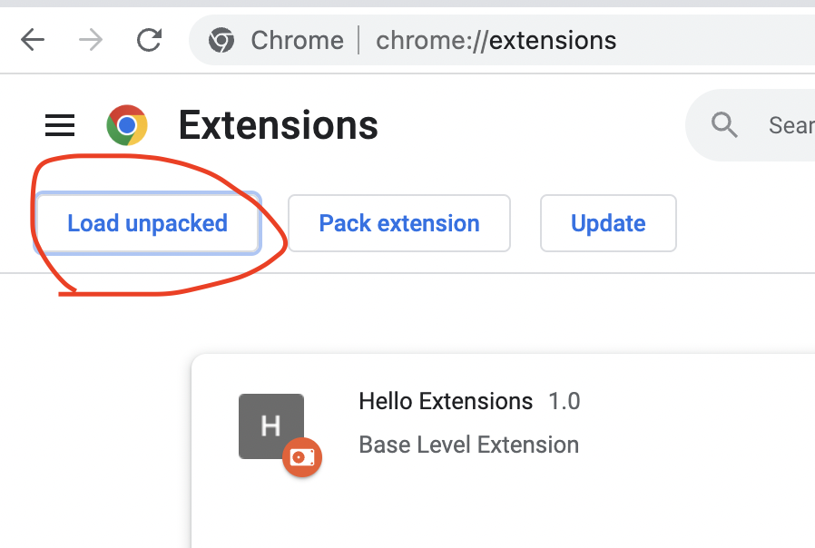
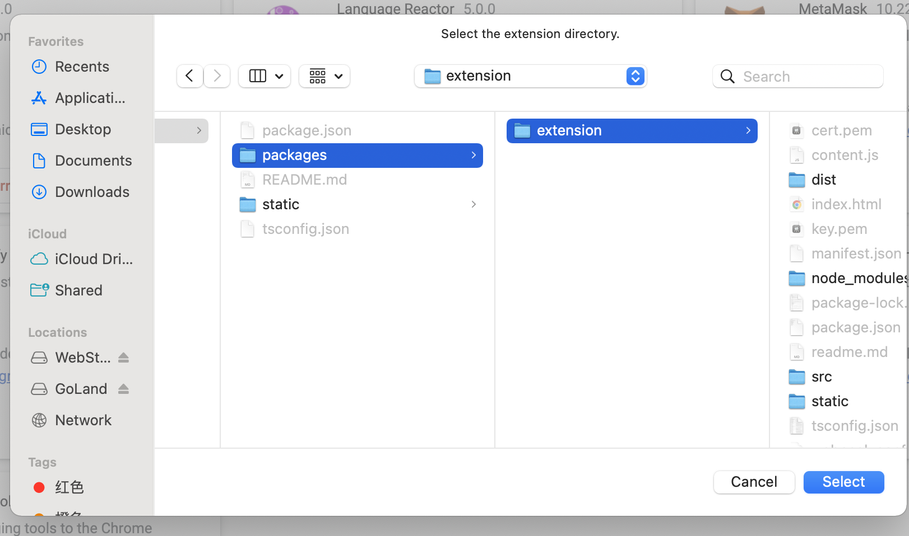
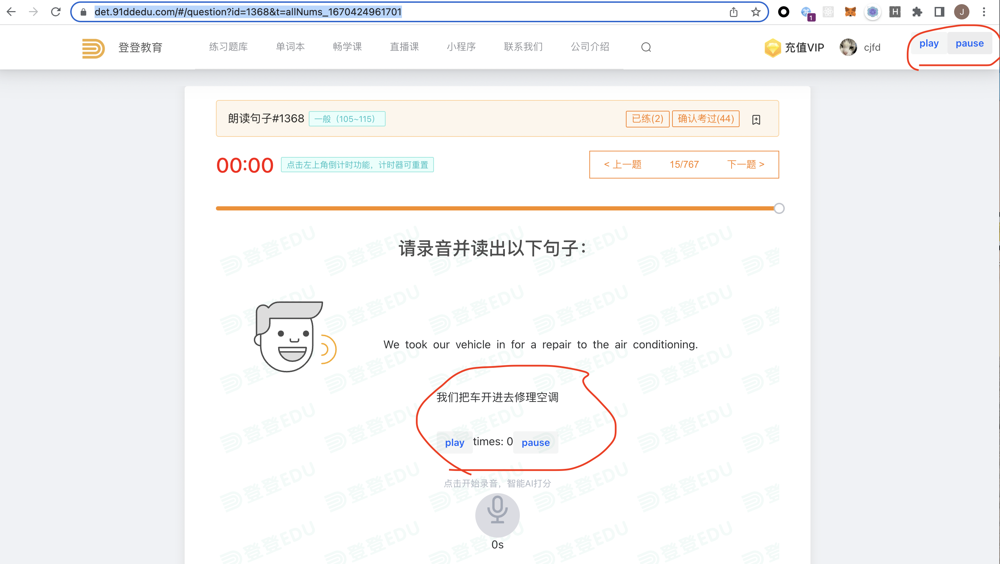

# 多邻国学习插件

## 背景：

今天在学习多邻国时，发现了登登多邻国这个网站，里面有在线练习的功能。

地址：https://det.91ddedu.com/#/question?id=1368&t=allNums_1670424961701

免责声明：这不是一条广告哈，登登请给我打钱。

不过这个网站是收费的，80多块一个月，个人感觉有点贵，不过为了学习嘛。

但这不是重点，重点在于我发现登登这里的口语有示范音频！

可以很方便的跟读练习，来自我矫正发音。

但是！网站却没有提供循环播放的功能，所以开发此 chrome 插件来支持循环播放。

### 0x01使用方法

#### 从编译版本获取

crx 下载地址：

https://github.com/JinJianQi/doulingo-learn/blob/master/packages/extension/dist.crx

#### 从源码获取

- 拉取代码库：

```bash
git clone https://github.com/JinJianQi/doulingo-learn
```

- 进入项目目录：

```bash
cd ./doulingo-learn/packages/extension
```

- 安装依赖

```bash
npm i
```

- 执行编译

```bash
npm run build
```

- chrome 加载插件





选择 `/doulingo-learn/packages/extension/dist` 文件夹

启用刚刚加载的插件


打开登登多邻国口语页面：



可以看到加载了这几个按钮

本地开发：

```
npm run start
```

- chrome 加载插件


选择 `/doulingo-learn/packages/extension` 文件夹
